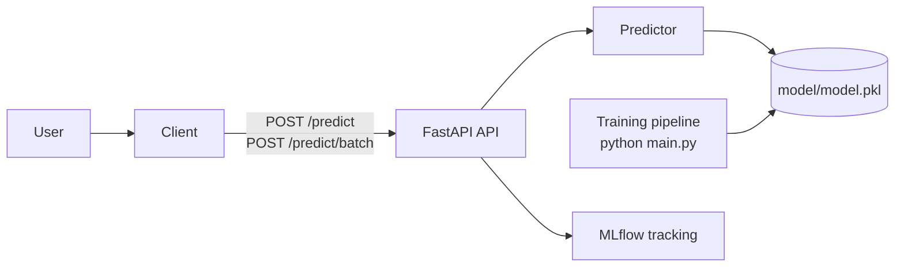

# content-moderation-mlops

Production-grade content moderation API with a lightweight MLOps pipeline. Built with FastAPI, scikit-learn, MLflow, and Docker.

## What it does

Classifies text as **spam** or **ham** using a TF-IDF + Logistic Regression model, served via a REST API with experiment tracking and monitoring.

## Architecture



## Project structure

```
content-moderation-mlops/
|-- app/                        # FastAPI application
|   |-- main.py                 # /health, /ready, /predict
|   |-- predictor.py            # Loads model bundle and serves predictions
|   |-- schemas.py              # Pydantic request/response validation
|   `-- logger.py               # Shared logger
|-- pipeline/                   # ML pipeline
|   |-- extract.py              # Reads SMS zip, returns DataFrame
|   |-- preprocessing.py        # Text cleaning
|   |-- train.py                # Train TF-IDF + LogisticRegression pipeline
|   |-- test_evaluate.py        # Metrics + MLflow logging
|   |-- save_model.py           # Save model bundle
|   `-- utils.py                # Dataset preview + save cleaned CSV
|-- config/
|   `-- settings.py             # Paths, hyperparameters, constants
|-- tests/
|   `-- test_api.py             # API tests (pytest)
|-- Dockerfile
|-- docker-compose.yml
|-- pyproject.toml
`-- main.py                     # Runs the full pipeline
```

## Stack

- FastAPI (API)
- scikit-learn (TF-IDF + Logistic Regression)
- MLflow (experiment tracking)
- Docker / Docker Compose
- slowapi (rate limiting)
- pytest (tests)

## Quickstart (Docker)

```bash
git clone <repo-url>
cd content-moderation-mlops

# Place dataset in data/
# sms+spam+collection.zip -> data/sms+spam+collection.zip

./Scripts/run.sh
```

## Production notes (model artifact)

In real deployments you typically **do not bake the model into the image**. Instead:

- set `MODEL_URL` to a trusted location containing `model.pkl`
- set `MODEL_SHA256` to verify the model file before loading

When you train locally, the pipeline writes a checksum file next to the model:

- `model/model.pkl.sha256`

## API endpoints

- `GET /health` (liveness): always `200` when the API process is up
- `GET /ready` (readiness): `200` only when the model is loaded
- `POST /predict`: returns `503` if the model is not loaded
- `POST /predict/batch`: classify multiple texts in one request

### Example: batch prediction

```bash
curl -X POST http://localhost:8000/predict/batch \
  -H "Content-Type: application/json" \
  -d '{"texts":["free prize call now","hey see you later"]}'
```
